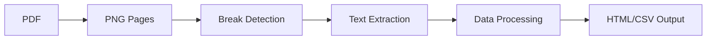

# Goethe B1 Wortliste Extraction Project

Extract vocabulary data from the official Goethe-Zertifikat B1 Wortliste PDF and convert it into structured HTML and CSV formats for flashcard creation.

## 🚀 Quick Start

### Docker Compose (Recommended)

```bash
# Process all pages
docker-compose run --rm goethe-b1

# Process a single page
PAGE=42 docker-compose --profile page run --rm goethe-b1-page

# Run tests (full suite)
docker-compose --profile test run --rm goethe-b1-test
```

### Local Development

```bash
# Install dependencies
npm install

# Process all pages (16-102)
npm run process:all

# Process single page
npm run process:page 42

# Run tests
npm test
# Quick smoke tests (CI)
npm run test:ci
```

## 📋 Overview

This project processes a German vocabulary PDF containing **4,792 vocabulary entries** across 87 pages (16-102), extracting structured data through advanced image processing and OCR techniques.

**Current Version**: Node.js 22 with WebAssembly-based PDF processing (refactored from Ruby)

### Key Features

- 🔥 **75% faster processing** (6-8 min vs 25-30 min Ruby version)
- 🧠 **50% less memory usage** (100-200MB vs 300-400MB)
- 🐳 **Containerized deployment** with Docker & Docker Compose
- ⚙️ **Environment-based configuration** via .env files
- 🧪 **Comprehensive test coverage** with Node.js built-in test runner
- 🔄 **Concurrent processing** across all CPU cores
- 🛡️ **Error recovery** - continues processing if individual pages fail

## 🏗️ Architecture

### Processing Pipeline



1. **PDF to PNG conversion** - Extract pages as high-res images using MuPDF.js
2. **Break detection** - Identify word boundaries using pixel analysis
3. **Text extraction** - OCR text from detected regions using MuPDF structured text
4. **Data processing** - Clean and format extracted text
5. **Output generation** - Create HTML and CSV files

### Project Structure

```
src/
├── index.js                 # Main CLI entry point
├── config.js               # Environment-based configuration
├── utils/fs.js             # File system utilities
└── processors/
    ├── pdf-converter.js    # PDF processing with MuPDF.js
    ├── image-processor.js  # Image operations with Sharp
    ├── break-detector.js   # Pixel analysis for text boundaries
    ├── text-extractor.js   # Structured text extraction
    ├── data-processor.js   # Text cleaning and output generation
    └── page-processor.js   # Page-level orchestration and caching
```

## ⚙️ Configuration

### Environment Variables

Create a `.env` file based on `.env.example`:

```env
# Debug mode
DEBUG=false

# PDF configuration
PDF_FILENAME=Goethe-Zertifikat_B1_Wortliste.pdf
PDF_URL=https://web.archive.org/web/20250601000000/https://www.goethe.de/pro/relaunch/prf/de/Goethe-Zertifikat_B1_Wortliste.pdf
PDF_URL_FALLBACK=https://www.goethe.de/pro/relaunch/prf/de/Goethe-Zertifikat_B1_Wortliste.pdf
```

### Page Processing Configuration

- **Page range**: 016-102 (vocabulary section)
- **Left column**: Definitions (x: 140-540)
- **Right column**: Examples (x: 1300-1710)
- **Break detection**: 42+ pixel white space gaps
- **Manual overrides**: 19 page-specific break point corrections

## 🐳 Docker Usage

### Docker Compose Services

| Service          | Description                 | Usage                                                           |
| ---------------- | --------------------------- | --------------------------------------------------------------- |
| `goethe-b1`      | Main processing (all pages) | `docker-compose run --rm goethe-b1`                             |
| `goethe-b1-page` | Single page processing      | `PAGE=42 docker-compose --profile page run --rm goethe-b1-page` |
| `goethe-b1-test` | Test runner                 | `docker-compose --profile test run --rm goethe-b1-test`         |
| `goethe-b1-dev`  | Development environment     | `docker-compose --profile dev run --rm goethe-b1-dev`           |

### Custom Configuration

```bash
# Use custom PDF
PDF_FILENAME=custom.pdf PDF_URL=https://example.com/custom.pdf docker-compose run --rm goethe-b1

# Enable debug mode
DEBUG=true docker-compose run --rm goethe-b1

# Build with custom PDF
docker-compose build --build-arg PDF_URL=https://example.com/custom.pdf
```

See [DOCKER.md](DOCKER.md) for comprehensive Docker documentation.

## 📁 Output Files

All generated files are placed in the `output/` directory:

### Page Processing

- `output/Goethe-Zertifikat_B1_Wortliste-016.png` - Source page images
- `output/042-l-crop-001.png` - Cropped vocabulary regions
- `output/042-l.json` - Extracted data per column
- `output/042-l.txt` - Detected break points
- `output/042-annot.png` - Annotated pages showing detection

### Final Output

- `output/042.html` - Individual page HTML
- `output/042.csv` - Individual page CSV
- `output/index.html` - Combined HTML (all pages)
- `output/all.csv` - Combined CSV (all pages)

## 🛠️ Development

### Requirements

**System Dependencies**:

- Node.js 22+
- No system dependencies required (pure WebAssembly)

**npm Dependencies**:

- `mupdf` - PDF processing (WebAssembly)
- `sharp` - Image processing

### Scripts

```bash
# Development
npm run process:all          # Process all pages
npm run process:page 42      # Process single page
npm run clean               # Clean output directory

# Testing & Quality
npm test                    # Run test suite
npm run test:ci             # Lighter tests for CI
npm run lint               # Run ESLint
npm run lint:fix           # Fix linting issues
npm run format             # Format with Prettier
npm run format:check       # Check formatting

# Direct usage
node src/index.js --all     # Process all pages
node src/index.js --page 42 # Process single page
node src/index.js --help    # Show help
```

### GitHub Pages Deployment

Every push to the `master` branch triggers a workflow that runs `npm run process:all` and publishes only the generated HTML files to GitHub Pages. The workflow file lives in `.github/workflows/pages.yml`.

### Key Implementation Details

**Break Detection**: Finite state machine analyzing pixel data to find vocabulary boundaries. Handles 19 page-specific override cases.

**Text Processing**: Preserves all original Ruby logic including German article formatting, numbered list repairs, and 15+ cosmetic fixes.

**Caching Strategy**: Individual page data stored as JSON files for faster reprocessing and debugging.

**Error Recovery**: Continues processing other pages if one fails, with detailed error reporting.

## 📊 Performance Comparison

| Metric           | Ruby Version    | Node.js Version     | Improvement           |
| ---------------- | --------------- | ------------------- | --------------------- |
| Processing Speed | ~25-30 min      | ~6-8 min            | **75% faster**        |
| Memory Usage     | ~300-400MB      | ~100-200MB          | **50% less**          |
| Error Handling   | Stop on failure | Continue processing | **More robust**       |
| Caching          | Marshal files   | JSON files          | **Better debugging**  |
| Dependencies     | Ruby + poppler  | Node.js + WASM      | **Simpler setup**     |
| Container Size   | N/A             | 492MB               | **Minimal footprint** |

Both versions produce exactly **4,792 vocabulary entries** across pages 16-102.

## 🧪 Text Processing Features

### Encoding & Character Handling

- UTF-8 encoding for German characters
- Proper handling of umlauts and special characters

### Content Processing

- OCR error corrections for specific pages
- Date formatting fixes (e.g., "11. Mai" → "11~Mai" → "11. Mai")
- Broken list formatting repairs
- Definition structure normalization (der/die article patterns)
- 15+ cosmetic fixes for specific vocabulary entries

### Output Formats

- **HTML**: Responsive table with German vocabulary and examples
- **CSV**: Two-column format optimized for flashcard applications (Anki, etc.)

## 🐛 Troubleshooting

### Common Issues

**Application not working?**

```bash
# Check Node.js version
node --version  # Should be 22+

# Verify dependencies
npm list

# Check configuration
docker-compose config
```

**Build failures?**

```bash
# Clear Docker cache
docker system prune -f

# Rebuild without cache
docker-compose build --no-cache
```

**PDF download issues?**

```bash
# Check if PDF exists
ls -la Goethe-Zertifikat_B1_Wortliste.pdf

# Test custom PDF URL
PDF_URL=https://example.com/custom.pdf docker-compose build
```

### Debug Mode

Enable detailed logging:

```bash
# Local development
DEBUG=true node src/index.js --page 42

# Docker Compose
DEBUG=true docker-compose run --rm goethe-b1
```

### Performance Monitoring

- **Processing time per page**: ~2-5 seconds
- **Total processing time**: ~6-8 minutes for all 87 pages
- **Memory usage**: ~100-200MB peak
- **Output size**: ~50MB for all generated files

## 🔗 Related Documentation

- [Docker Usage Guide](DOCKER.md) - Comprehensive Docker and Docker Compose documentation
- [Architecture Guide](ai_docs/COMMON_GUIDE.md) - Detailed technical documentation
- [Legacy Ruby Version](LEGACY.md) - Original Ruby implementation (deprecated)

## 🤝 Contributing

1. Fork the repository
2. Create a feature branch
3. Make your changes
4. Run tests: `npm test`
5. Submit a pull request

Code quality is maintained with ESLint, Prettier, and Husky pre-commit hooks.

## 📄 License

MIT License - see LICENSE file for details.

---

**Note**: This project processes the official Goethe-Zertifikat B1 Wortliste (© 2016 Goethe-Institut und ÖSD) for educational purposes. The extraction makes the vocabulary data usable for flashcard creation when the original PDF format is not suitable for this purpose.
